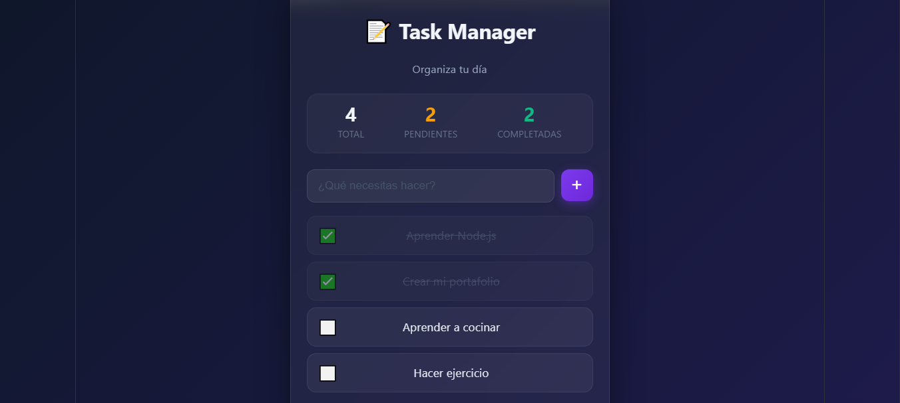

# 📝 Task Manager App

Aplicación web full-stack para gestionar tareas, construida con Node.js, Express y React.


## 🚀 Demo

> Coming soon — deploy en Vercel + Railway


---


## ✨ Funcionalidades

- ✅ Crear tareas
- ✅ Marcar tareas como completadas
- ✅ Eliminar tareas
- ✅ Contador de tareas (total, pendientes, completadas)
- ✅ Diseño responsive mobile-first
- ✅ Animaciones suaves

---

## 🛠️ Stack Tecnológico

| Capa | Tecnología |
|------|-----------|
| Backend | Node.js + Express |
| Frontend | React + Vite |
| HTTP Client | Axios |
| Dev Tool | Nodemon |

---

## 📁 Estructura del Proyecto
```
task-manager/
├── backend/
│   ├── src/
│   │   ├── controllers/
│   │   │   └── tasksController.js
│   │   ├── routes/
│   │   │   └── tasks.js
│   │   └── index.js
│   ├── .env.example
│   ├── .gitignore
│   ├── package-lock.json
│   └── package.json
├── frontend/
│   ├── public/
│   ├── src/
│   │   ├── App.jsx
│   │   └── App.css
│   ├── .gitignore
│   ├── eslint.config.js
│   ├── index.html
│   ├── package-lock.json
│   ├── package.json
│   └── vite.config.js
├── .gitignore
└── README.md
```


---

## ⚙️ Instalación y uso local

### 1. Clona el repositorio
```bash
git clone https://github.com/msuarez011/task-manager.git
cd task-manager
```

### 2. Configura el Backend
```bash
cd backend
npm install
cp .env.example .env
npm run dev
```

El servidor correrá en: `http://localhost:3000`

### 3. Configura el Frontend

Abre una nueva terminal:
```bash
cd frontend
npm install
npm run dev
```

La app correrá en: `http://localhost:5173`

---

## 🔌 API Endpoints

| Método | Ruta | Descripción |
|--------|------|-------------|
| GET | `/api/tasks` | Obtener todas las tareas |
| POST | `/api/tasks` | Crear una nueva tarea |
| PATCH | `/api/tasks/:id/toggle` | Marcar tarea como completada |
| DELETE | `/api/tasks/:id` | Eliminar una tarea |

---

## 🔮 Próximas mejoras

- [ ] Conectar base de datos (Supabase)
- [ ] Autenticación de usuarios
- [ ] Deploy en producción (Vercel + Railway)
- [ ] Filtros por estado (pendientes / completadas)

---

## 👨‍💻 Autor

**Marcelo Suárez Paz**
[](https://github.com/msuarez011)